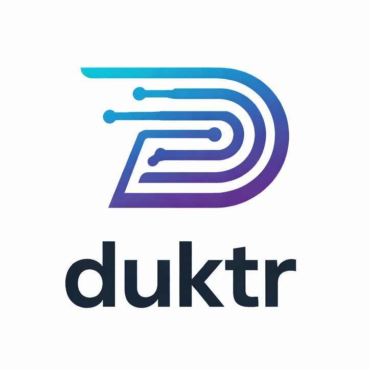

# Welcome to duktr

<h3 align="center"><strong>deduct + induct via LLMs</strong></h3>

`duktr` is an LLM-powered Python package for **dynamic concept mining** and **mixed-membership (multi-label) assignment/clustering** over text. It maintains an evolving catalog of concepts and, for each input text, returns the set of concepts that describe it, reusing existing concepts where possible and introducing new concepts when needed.

This is useful when the concept set cannot be pre-defined and will evolve over time (e.g., news topics, issues in tickets, patients’ symptoms, canonical product identities). You define what a “concept” means for your use case, and `duktr` provides the flexibility to extract the concepts you have in mind to cluster textual information based on the specified concept.

## Features

- **Mixed-membership labeling:** each text can map to zero, one, or many concepts.
- **Dynamic concept discovery:** concepts are discovered from data and the catalog grows over time.
- **Catalog-aware prompting:** prompts reuse of existing concepts to avoid drift/duplication and to support clustering.
- **Scales to large catalogs:** progressive partitioning keeps LLM inputs bounded as the catalog grows.
- **Pluggable LLM backends:** OpenAI, Gemini, or a custom Python function (including your LLM of choice, e.g., Hugging Face).

## Next Steps

- **[Installation](./installation.md):** Get `duktr` installed in your environment.
- **[Quickstart](./quickstart.md):** A step-by-step guide to getting started with `duktr`.
- **[API Reference](./api.md):** A detailed API reference for all public classes and functions.
- **[Using a Custom LLM](./custom_llm.md):** Learn how to use `duktr` with your own custom LLM, including models from Hugging Face.
